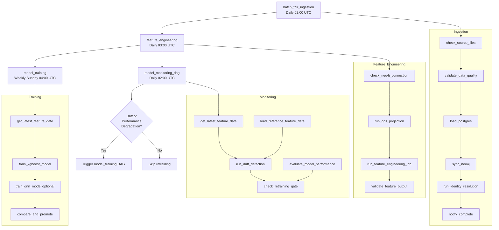
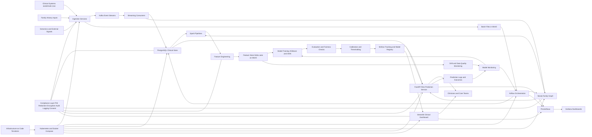
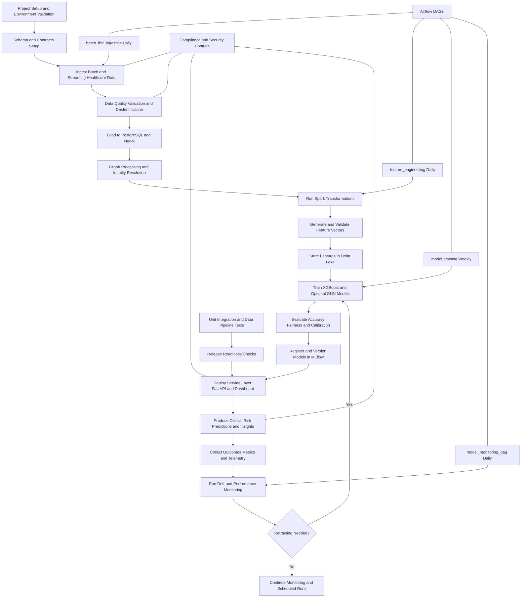

# Project Component Usage and Importance

This document explains how key technologies are implemented in the Healthcare Hereditary Disease Prediction System and why each one is critical to project success.

## 1. ML Models

### How ML models are used in this project
- The project uses multiple model types for hereditary risk prediction, including XGBoost and graph-based models (GNN variants) in the `ml/models/` and `ml/training/` modules.
- Model training and evaluation pipelines are implemented in files such as `ml/training/train_gnn.py`, `ml/training/evaluate.py`, and related training modules.
- Models are tracked and versioned with MLflow, and serving logic is exposed through API/dashboard layers (`services/api/` and `services/streamlit/`).

### Why ML models are important
- They provide patient-level risk estimation for hereditary disease, which is the core business and clinical objective of the platform.
- Using both tabular and graph-aware models improves predictive quality by combining clinical signals with family-relationship structure.
- Versioned models and evaluation workflows support reproducibility, controlled promotion, and safer clinical decision support.

## 2. Spark

### How Spark is used in this project
- Spark jobs are organized under `pipelines/spark/` for distributed processing of clinical and graph-derived data.
- Spark is part of the ingestion and transformation architecture, used to process larger datasets, standardize records, and generate model-ready outputs.
- Spark integrates with the project data lake pattern (MinIO + table formats in the architecture docs) for scalable feature data preparation.

### Why Spark is important
- It enables scalable processing when data volume and transformation complexity exceed single-node workflows.
- It supports reliable and repeatable batch transformations, a requirement for stable model training datasets.
- It helps unify heterogeneous data sources (clinical records + lineage/relationship signals) into consistent feature tables.

## 3. Kafka

### How Kafka is used in this project
- Kafka appears in the runtime stack and compose infrastructure (`infra/compose/`) and is used for streaming and asynchronous ingestion.
- Service-level consumers are organized under `services/consumers/`, where event-driven processing can consume and react to healthcare data events.
- Kafka supports decoupled ingestion between source systems and downstream processing/training services.

### Why Kafka is important
- It provides durable, event-driven data flow for near-real-time updates.
- It decouples producers and consumers, improving resilience and allowing independent scaling of ingestion and analytics services.
- It enables streaming-first architecture patterns needed for timely monitoring and model/data update workflows.

## 4. Feature Engineering

### How feature engineering is used in this project
- Feature definitions and schemas are structured in `ml/features/` (for example, feature registry and schema modules).
- The project generates features from multiple domains: demographics, comorbidities, medications, observations, and family-graph context.
- Feature engineering outputs feed both model training (`ml/training/`) and inference-serving paths.

### Why feature engineering is important
- Feature quality directly determines model quality; robust features improve predictive performance and calibration.
- Domain-aware features encode hereditary risk factors that raw records alone may not expose clearly.
- Standardized feature contracts reduce training-serving skew and improve production reliability.

## 5. Airflow

### How Airflow is used in this project
- Airflow orchestration assets are under `pipelines/airflow/`.
- The project has multiple production-style DAGs in `pipelines/airflow/dags/`:
	- `batch_ingestion_dag.py` (`batch_fhir_ingestion`): daily 02:00 UTC ingestion from MinIO, quality validation, load to PostgreSQL, sync to Neo4j, and completion notification.
	- `feature_engineering_dag.py` (`feature_engineering`): daily 03:00 UTC feature pipeline with Neo4j checks, graph projection, Spark feature generation, and feature output validation.
	- `model_training_dag.py` (`model_training`): weekly Sunday 04:00 UTC training workflow for XGBoost and optional GNN, with metric threshold checks and model staging promotion logic.
	- `model_monitoring_dag.py` (`model_monitoring_dag`): daily monitoring for drift/performance; automatically triggers retraining when drift or degradation gates are crossed.
- Airflow coordinates end-to-end dependencies between data ingestion, feature computation, model lifecycle operations, and retraining decisions.
- Compose and runbook setup supports optional orchestration profiles for local and environment-based operations.

### Why Airflow is important
- It provides reliable dependency management and scheduling for complex data/ML pipelines.
- It improves operational observability and recoverability through DAG-level monitoring and retry behavior.
- It enforces a repeatable MLOps cadence: timed ingestion, deterministic feature refresh, scheduled training, and monitoring-driven retraining.
- It reduces manual operational risk by automating task order, retries, and gating conditions across clinical data and ML workflows.

### Airflow DAG Mermaid Diagram

## 6. Compliance

### How compliance is implemented in this project
- Compliance controls are represented in shared libraries under `libs/common/`, including PHI handling, de-identification, encryption, logging, and quality controls.
- Project documentation and standards enforce strict rules such as no PHI leakage in logs, encrypted handling of sensitive data, and environment-based secret management.
- Security/compliance expectations are integrated into architecture, coding standards, and operational runbooks.

### Why compliance is important
- Healthcare workloads require HIPAA/GDPR-aligned handling of protected data; compliance is mandatory, not optional.
- Strong compliance controls reduce legal, ethical, and operational risk for patient data processing.
- Trustworthy compliance practices are essential for deploying clinical decision-support systems in real environments.

## Summary

These six components work together as a unified healthcare AI platform:
- ML models deliver predictive intelligence.
- Spark and Kafka provide scalable batch + streaming data foundations.
- Feature engineering converts raw healthcare and family data into reliable model inputs.
- Airflow orchestrates repeatable, production-grade workflows.
- Compliance ensures the system is safe, lawful, and clinically trustworthy.

## Entire System Architecture (Mermaid)

## Entire System Workflow (Mermaid)

## Detailed ETL Process (Mermaid)

```mermaid
flowchart TD
	%% -----------------------------
	%% EXTRACT
	%% -----------------------------
	E0[Airflow batch_fhir_ingestion start] --> E1[Read runtime config and source prefix]
	E1 --> E2[List objects from MinIO raw bucket]
	E2 --> E3{Files found?}
	E3 -- No --> E4[Skip run with AirflowSkipException]
	E3 -- Yes --> E5[Select run batch file set]
	E5 --> E6[Download FHIR bundles and CSV payloads]
	E6 --> E7[Parse resources by type]
	E7 --> E8[Build staging records patients conditions medications observations family history]

	%% -----------------------------
	%% VALIDATE + GOVERNANCE
	%% -----------------------------
	E8 --> V1[Run Great Expectations validation]
	V1 --> V2[Schema checks required columns types ranges]
	V2 --> V3[Clinical quality checks duplicates nulls code format]
	V3 --> V4[Security checks deidentification and PHI-safe logging]
	V4 --> V5{Validation passed?}
	V5 -- No --> V6[Write validation failure report and stop load]
	V5 -- Yes --> T1[Proceed to transform]

	%% -----------------------------
	%% TRANSFORM
	%% -----------------------------
	T1 --> T2[Normalize FHIR to internal canonical schema]
	T2 --> T3[Standardize identifiers and timestamps]
	T3 --> T4[Resolve patient identity and linkage keys]
	T4 --> T5[Apply terminology mapping ICD SNOMED LOINC where available]
	T5 --> T6[Derive relationship edges for family graph]
	T6 --> T7[Enrich records with lineage and provenance metadata]
	T7 --> T8[Prepare relational upsert payloads]
	T7 --> T9[Prepare graph merge payloads]

	%% -----------------------------
	%% LOAD
	%% -----------------------------
	T8 --> L1[Load PostgreSQL clinical tables]
	L1 --> L2[Use INSERT ON CONFLICT for idempotent writes]
	L2 --> L3[Commit transaction and capture row stats]

	T9 --> L4[Load Neo4j nodes and relationships]
	L4 --> L5[Use MERGE for idempotent graph sync]
	L5 --> L6[Persist graph synchronization markers]

	L3 --> L7[Publish ingestion completion event to Kafka]
	L6 --> L7
	L7 --> L8[Notify downstream workflows]

	%% -----------------------------
	%% FEATURE ETL (nightly)
	%% -----------------------------
	L8 --> F0[Airflow feature_engineering start]
	F0 --> F1[Check Neo4j connectivity and GDS availability]
	F1 --> F2[Run graph projection and graph metrics write-back]
	F2 --> F3[Run Spark feature engineering job]
	F3 --> F4[Extract from PostgreSQL and Neo4j]
	F4 --> F5[Join clinical plus graph signals]
	F5 --> F6[Compute patient feature vectors]
	F6 --> F7[Write Delta feature tables to MinIO]
	F7 --> F8[Validate feature outputs Great Expectations]
	F8 --> F9{Feature validation passed?}
	F9 -- No --> F10[Mark run failed and raise alert]
	F9 -- Yes --> F11[Publish feature snapshot metadata]

	%% -----------------------------
	%% OPERATIONS + MONITORING
	%% -----------------------------
	F11 --> O1[Record lineage metrics and run artifacts]
	O1 --> O2[Expose pipeline metrics to Prometheus]
	O2 --> O3[Visualize ETL health in Grafana]
	O1 --> O4[Feed model training and monitoring DAGs]

	%% -----------------------------
	%% ERROR PATHS AND RETRIES
	%% -----------------------------
	V6 --> R1[Airflow retry policy with backoff]
	F10 --> R1
	R1 --> R2{Retries exhausted?}
	R2 -- No --> E0
	R2 -- Yes --> R3[Create incident log and require operator intervention]
```

