# Healthcare Hereditary Disease Prediction System — Master Project Documentation

> **Purpose of this document.** This is the single source-of-truth scaffold used to
> assemble the final project documentation and deliverables. It covers project
> management, requirements, system analysis & design (with UML/ERD/DFD diagrams),
> UI/UX, deployment & integration, and additional deliverables (API docs, testing,
> deployment strategy).
>
> Diagrams are written in **Mermaid** so they render directly on GitHub/GitLab and in
> most Markdown viewers. Replace every _`TBD`_ / bracketed placeholder with your
> project-specific values before submission.

**Project:** Healthcare Hereditary Disease Prediction System
**Team:** Healthcare Team
**Document version:** 1.0
**Last updated:** 2026-07-10
**Status:** Phases 1–9 complete (see [§9 Phase Status](#9-project-phase-status))

---

## Table of Contents

1. [Project Planning & Management](#1-project-planning--management)
2. [Literature Review](#2-literature-review)
3. [Requirements Gathering](#3-requirements-gathering)
4. [System Analysis & Design](#4-system-analysis--design)
5. [Database Design & Data Modeling](#5-database-design--data-modeling)
6. [Data Flow & System Behavior](#6-data-flow--system-behavior)
7. [UI/UX Design & Prototyping](#7-uiux-design--prototyping)
8. [System Deployment & Integration](#8-system-deployment--integration)
9. [Project Phase Status](#9-project-phase-status)
10. [Additional Deliverables](#10-additional-deliverables)
11. [Appendices](#11-appendices)

---

## 1. Project Planning & Management

### 1.1 Project Proposal

**Problem.** Hereditary (genetic/familial) diseases are frequently under-detected because
risk signals are spread across a patient's clinical record, their **family history**, and
increasingly their **genomic data**. Clinicians lack a unified tool that combines these
signals, quantifies inherited risk, and turns it into actionable screening recommendations.

**Solution.** A production-grade platform that:

- Stores clinical records in **PostgreSQL** and family-relationship graphs in **Neo4j**.
- Engineers features from demographics, comorbidities, medications, and family-graph structure.
- Trains and serves ML models (**XGBoost** + **Graph Neural Networks**) to predict
  hereditary disease risk, with calibration and fairness monitoring.
- Exposes results through a **FastAPI** service and an interactive **Streamlit** dashboard.
- Treats **PHI compliance (HIPAA/GDPR)** as non-negotiable at every layer (field-level
  encryption, audit logging, PHI redaction, granular patient consent).

**Objectives.**

| # | Objective | Success signal |
|---|-----------|----------------|
| O1 | Predict hereditary disease risk from combined clinical + family + genomic data | Calibrated risk score with Brier score + reliability diagram |
| O2 | Model families as first-class graphs and reason over inheritance | Neo4j family graph + Mendelian/cascade tooling |
| O3 | Provide clinician decision support (what-if, guidelines, screening) | Guideline-based recommendations returned per patient |
| O4 | Guarantee PHI compliance end-to-end | Encryption at rest, audit log, consent-gated export |
| O5 | Be interoperable with health IT ecosystems | FHIR R4 endpoints, SMART-on-FHIR patient portal, CSV import/export |
| O6 | Be production-operable | Containerized services, observability, MLOps, CI |

**Scope (In).** Risk prediction, family graph analytics, clinical CRUD, genetics/genomics
(Mendelian calculator, cascade screening, PRS), decision support, FHIR interoperability,
de-identified research export, patient portal & consent, MLOps & observability.

**Scope (Out).** Real EHR production integration with live PHI, regulatory certification
(this handles synthetic/simulated data), billing/claims, telemedicine, mobile-native apps.

### 1.2 Project Plan (Timeline, Milestones, Deliverables)

The project was delivered in **9 phases**, mapped onto a Gantt timeline.

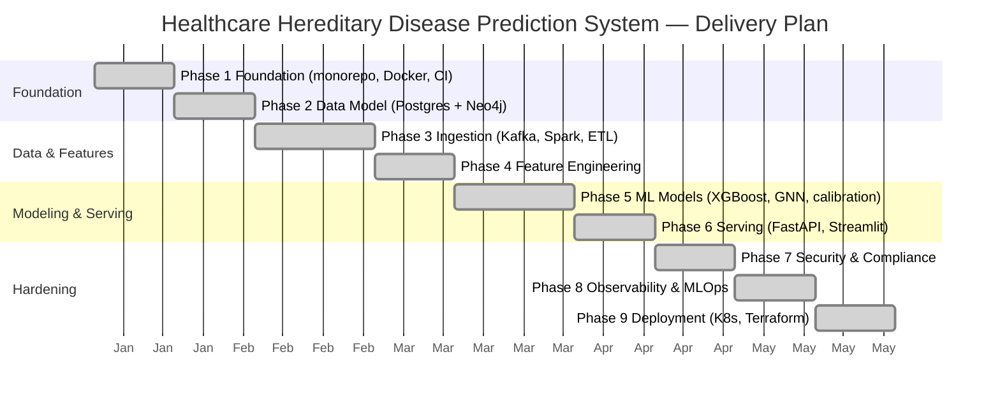

**Milestones & deliverables.**

| Milestone | Phase | Key deliverables |
|-----------|-------|------------------|
| M1 — Repo & CI ready | 1 | Monorepo layout, Docker Compose, CI skeleton, `.env.example` |
| M2 — Data model frozen | 2 | Postgres schema (Alembic migrations), Neo4j constraints, ORM models |
| M3 — Ingestion live | 3 | Kafka topics, Avro schemas, Spark ETL, patient/family loaders |
| M4 — Feature store | 4 | Feature definitions, family-graph features, feature service |
| M5 — Models trained | 5 | XGBoost + GNN training pipelines, calibration, MLflow registry |
| M6 — Services running | 6 | FastAPI endpoints, Streamlit dashboard, prediction logging |
| M7 — Compliant | 7 | Field encryption, RBAC, audit log, consent, PHI redaction |
| M8 — Observable | 8 | Prometheus/Grafana, drift & fairness monitoring, structured logs |
| M9 — Deployable | 9 | Dockerfiles, K8s manifests, Terraform, deployment runbook |

### 1.3 Task Assignment & Roles

> Fill in real names. Roles below reflect the functional areas the codebase requires.

| Role | Responsibilities | Owner |
|------|------------------|-------|
| Project Lead / PM | Planning, milestones, risk, stakeholder comms | _TBD_ |
| Backend / API Engineer | FastAPI services, routers, auth, business logic | _TBD_ |
| Data Engineer | Kafka/Spark ingestion, Postgres/Neo4j schemas, ETL | _TBD_ |
| ML Engineer | Feature engineering, XGBoost/GNN training, calibration, MLflow | _TBD_ |
| MLOps / DevOps | Docker, Kubernetes, Terraform, CI/CD, observability | _TBD_ |
| Security & Compliance | PHI encryption, RBAC, audit, consent, HIPAA/GDPR mapping | _TBD_ |
| Frontend / UX | Streamlit dashboard, patient portal, wireframes | _TBD_ |
| QA / Test Engineer | Unit/integration tests, coverage, UAT plan | _TBD_ |

### 1.4 Risk Assessment & Mitigation Plan

| ID | Risk | Likelihood | Impact | Mitigation |
|----|------|-----------|--------|------------|
| R1 | **PHI leak** (logs, exports, breach) | Med | Critical | PHI redaction (`libs/common/phi.py`), field-level encryption, consent-gated export, audit log, gitleaks in CI |
| R2 | **Model bias** across demographic subgroups | Med | High | Fairness monitoring, subgroup metrics, race/ethnicity captured for analysis only |
| R3 | **Data leakage** in train/test split | Med | High | Split strictly by **patient ID**, never by row |
| R4 | **Miscalibrated risk** misleads clinicians | Med | High | Brier score + reliability diagrams; no model marked ready without calibration |
| R5 | **Secret exposure** | Low | Critical | 12-factor config, `.env` gitignored, min 32-char secrets enforced at startup, Vault/KMS in prod |
| R6 | **Infra cost / resource exhaustion** (full stack heavy) | Med | Med | Compose profiles (skip Kafka/Spark/Airflow locally), autoscaling in K8s |
| R7 | **Third-party/version drift** (pinned stack) | Low | Med | Pinned versions in `pyproject.toml`/`requirements.txt`, Dependabot/CI |
| R8 | **Scope creep** across many tiers | Med | Med | Phase gates, feature flags (`ENABLE_GNN_MODEL`, `ENABLE_SYMPTOM_MODEL`) |
| R9 | **Data quality** in ingestion (bad FHIR/CSV) | Med | Med | Pydantic v2 validation at boundaries, Avro schema registry, import validation |
| R10 | **Regulatory non-compliance** (HIPAA/GDPR) | Low | Critical | Consent model, right-to-erasure via soft-delete, de-identification for research |

### 1.5 KPIs (Key Performance Indicators)

| Category | KPI | Target |
|----------|-----|--------|
| Model quality | ROC-AUC (hereditary risk) | ≥ 0.80 |
| Model quality | Brier score (calibration) | ≤ 0.15 |
| Model fairness | Max subgroup AUC gap | ≤ 0.05 |
| Performance | API p95 latency (`/predict/*`) | ≤ 300 ms |
| Reliability | Service uptime | ≥ 99.5% |
| Reliability | Successful deploy rate | ≥ 95% |
| Quality | Test coverage (`libs/`, `services/`, `pipelines/`, `ml/`) | ≥ 85% |
| Security | PHI-in-logs incidents | 0 |
| Adoption | Active clinician users / week | _TBD_ |
| Adoption | Predictions served / day | _TBD_ |
| MLOps | Model drift alerts acknowledged within | ≤ 24 h |

---

## 2. Literature Review

> This section holds the academic framing and the lecturer's assessment. Populate the
> evaluation subsections after review.

### 2.1 Background & Related Work

| Theme | Reference / approach | Relevance to this project |
|-------|----------------------|---------------------------|
| Hereditary risk scoring | Family-history-based risk models (e.g., Gail, Tyrer-Cuzick style) | Baseline for combining family history into risk |
| Graph ML in healthcare | Graph Neural Networks over patient/family graphs | Motivates the Neo4j + GNN (GraphSAGE) design |
| Polygenic risk scores (PRS) | GWAS-derived PRS integration | Blended into risk via the PRS module |
| Mendelian inheritance | Autosomal dominant/recessive, X-linked patterns | Basis for the inheritance calculator |
| Cascade screening | Guideline-driven relative screening | Basis for cascade-screening workflow |
| FHIR / interoperability | HL7 FHIR R4 | Data exchange & patient portal (SMART-on-FHIR) |
| Model calibration & fairness | Brier score, reliability diagrams, subgroup metrics | Trust & decision-support layer |

_Add full citations (APA/IEEE) in [Appendix A](#appendix-a-references)._

### 2.2 Feedback & Evaluation (Lecturer's Assessment)

> _To be completed by the lecturer._

### 2.3 Suggested Improvements

> _Record reviewer suggestions and the team's response/plan here._

### 2.4 Final Grading Criteria (Breakdown)

| Criterion | Weight | Notes |
|-----------|--------|-------|
| Documentation | _TBD %_ | This document + README + ADRs |
| Implementation | _TBD %_ | Services, models, pipelines |
| Testing | _TBD %_ | Unit/integration coverage, UAT |
| Presentation | _TBD %_ | Demo + slides |
| **Total** | **100%** | |

---

## 3. Requirements Gathering

### 3.1 Stakeholder Analysis

| Stakeholder | Needs / Interests | Interaction with system |
|-------------|-------------------|-------------------------|
| **Clinician / Geneticist** | Accurate risk scores, family analysis, actionable recommendations | API + Streamlit dashboard |
| **Patient** | View own risk, manage consent, access records | SMART-on-FHIR patient portal |
| **Data Scientist / ML Engineer** | Feature store, experiment tracking, drift/fairness metrics | MLflow, monitoring endpoints |
| **Hospital / Organization Admin** | Multi-tenant isolation, user management, reporting | Organization endpoints, RBAC |
| **Compliance Officer** | Audit trail, consent enforcement, encryption, de-identification | Audit log, consent, export controls |
| **DevOps / SRE** | Deployability, observability, scaling | K8s, Terraform, Grafana/Prometheus |
| **Researcher (external)** | De-identified datasets under consent | De-id export endpoint |

### 3.2 User Stories

- **US1 (Clinician):** As a clinician, I want to enter a patient's clinical and family
  data and receive a hereditary-risk score so I can decide on screening.
- **US2 (Clinician):** As a clinician, I want to see which family members contribute to
  risk so I can explain it to the patient.
- **US3 (Clinician):** As a clinician, I want guideline-based recommendations so my
  decisions are evidence-aligned.
- **US4 (Clinician):** As a clinician, I want a "what-if" simulator to see how risk
  changes if a risk factor is added/removed.
- **US5 (Geneticist):** As a geneticist, I want a Mendelian inheritance calculator and
  cascade-screening list for at-risk relatives.
- **US6 (Patient):** As a patient, I want to view my risk profile and grant/revoke
  research consent.
- **US7 (Admin):** As an org admin, I want my organization's data isolated from others.
- **US8 (Compliance):** As a compliance officer, I want every access to PHI recorded in
  an immutable audit log.
- **US9 (Researcher):** As a researcher, I want a de-identified export of consented
  patients only.
- **US10 (ML Engineer):** As an ML engineer, I want drift and fairness metrics so I know
  when to retrain.

### 3.3 Use Cases (Descriptions)

| ID | Use Case | Actor | Precondition | Main flow (summary) | Postcondition |
|----|----------|-------|--------------|---------------------|---------------|
| UC1 | Predict hereditary risk | Clinician | Authenticated; patient exists | Submit patient ID → features assembled → model scores → return risk + category + recommendations | Prediction logged |
| UC2 | Manage patient record | Clinician | Authenticated (RBAC) | Create/read/update/soft-delete patient & clinical data | Record persisted + audited |
| UC3 | Analyze family graph | Clinician | Patient has family links | Traverse Neo4j graph → inheritance patterns → family-risk profile | Family risk profile returned |
| UC4 | Cascade screening | Geneticist | Proband identified | Identify at-risk relatives → generate screening tasks | Cascade tasks created |
| UC5 | What-if simulation | Clinician | Model available | Modify risk factors → re-score | Simulated risk returned (not persisted) |
| UC6 | FHIR exchange | External system | API key/auth | GET/POST FHIR R4 resources | Interop payload exchanged |
| UC7 | De-identified export | Researcher | Consent recorded | Filter consented patients → de-identify → export | De-id dataset produced |
| UC8 | Manage consent | Patient | Portal login | Grant/revoke consent (append-only) | Consent record appended, enforced at export |
| UC9 | Monitor model | ML Engineer | Predictions logged | Compute drift/fairness | Metrics + alerts |

### 3.4 Functional Requirements

| ID | Requirement |
|----|-------------|
| FR1 | Authenticate users via JWT; authorize by role (RBAC). |
| FR2 | CRUD for patients, conditions, medications, encounters, observations/vitals. |
| FR3 | Model and query family relationships in Neo4j. |
| FR4 | Predict hereditary disease risk (score, category, recommendations). |
| FR5 | Predict disease from symptoms and from prescriptions (optional models). |
| FR6 | Provide family-risk profile and risk history per patient. |
| FR7 | Batch screening across patient cohorts. |
| FR8 | Genetics: Mendelian inheritance calculator, cascade screening, genetic-test/variant ingestion, PRS. |
| FR9 | Decision support: what-if simulator, guideline recommendations. |
| FR10 | Generate clinical PDF reports. |
| FR11 | FHIR R4 read/write endpoints. |
| FR12 | Bulk CSV import and de-identified research export. |
| FR13 | Notifications and multi-tenant organizations. |
| FR14 | Consent management (append-only) enforced at export. |
| FR15 | SMART-on-FHIR patient portal. |
| FR16 | Model monitoring (drift, fairness) endpoints. |
| FR17 | Immutable audit logging of PHI access. |
| FR18 | Expose Prometheus metrics and health/readiness probes. |

### 3.5 Non-Functional Requirements

| Category | Requirement |
|----------|-------------|
| **Security** | Field-level PHI encryption at rest; JWT auth; RBAC; API keys for machine clients; secrets ≥ 32 chars; no PHI in logs. |
| **Compliance** | HIPAA/GDPR: audit trail, consent, right-to-erasure (soft delete), de-identification for research. |
| **Performance** | `/predict/*` p95 ≤ 300 ms; dashboard interactions ≤ 1 s for cached queries. |
| **Scalability** | Horizontally scalable stateless API on Kubernetes; Redis caching; partitionable ingestion via Kafka/Spark. |
| **Reliability** | ≥ 99.5% uptime; health/readiness probes; graceful model-load failure handling. |
| **Usability** | Self-documenting API (Swagger/ReDoc); accessible Streamlit UI. |
| **Maintainability** | Python 3.11 type hints, Pydantic v2, Ruff+Black (line 100), mypy strict, ≥ 85% coverage, docstrings. |
| **Observability** | Structured JSON logging, Prometheus metrics, Grafana dashboards, MLflow tracking. |
| **Portability** | 12-factor config; runs via Docker Compose locally and K8s in cloud. |

---

## 4. System Analysis & Design

### 4.1 Problem Statement & Objectives

See [§1.1](#11-project-proposal). In short: **inherited disease risk signals are
fragmented across clinical, family, and genomic data**; this system unifies them into a
calibrated, compliant, interoperable decision-support platform.

### 4.2 Use Case Diagram

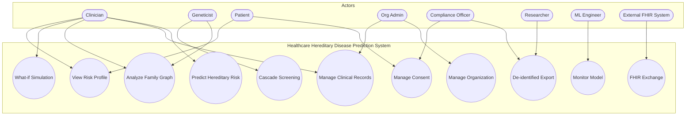

### 4.3 Functional & Non-Functional Requirements

See [§3.4](#34-functional-requirements) and [§3.5](#35-non-functional-requirements).

### 4.4 Software Architecture

**Style:** **Microservices + polyglot persistence**, layered internally (API →
service/business → data-access → databases), with an event-driven ingestion path
(Kafka → Spark) and an ML training/serving path (MLflow). The FastAPI service is
organized into **routers** (one module per domain) over shared **services** and
**ORM models**.

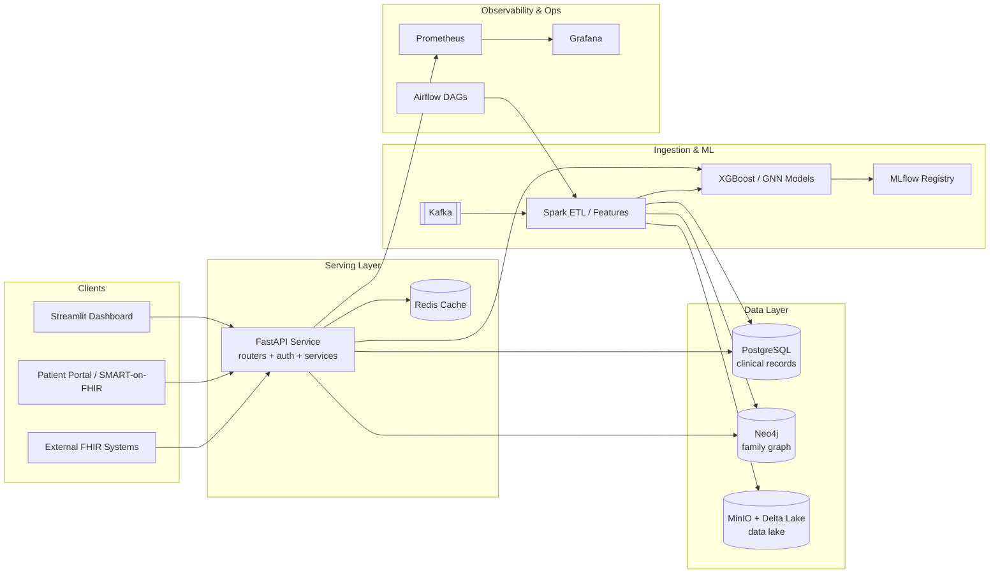

**Layered view (inside the API service):**

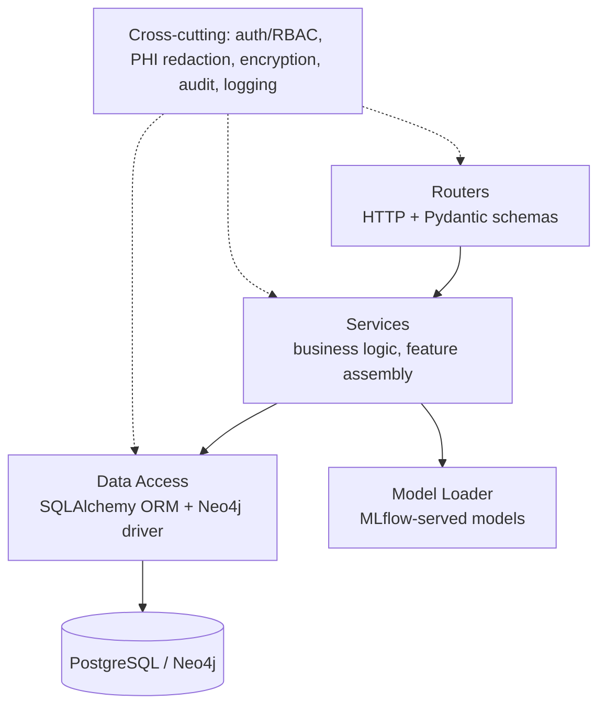

### 4.5 Component Diagram

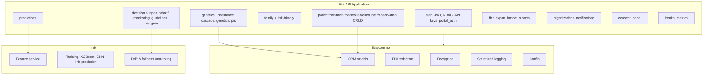

### 4.6 Class Diagram (Domain Model)

Reflects the SQLAlchemy ORM models in `libs/common/models/`.

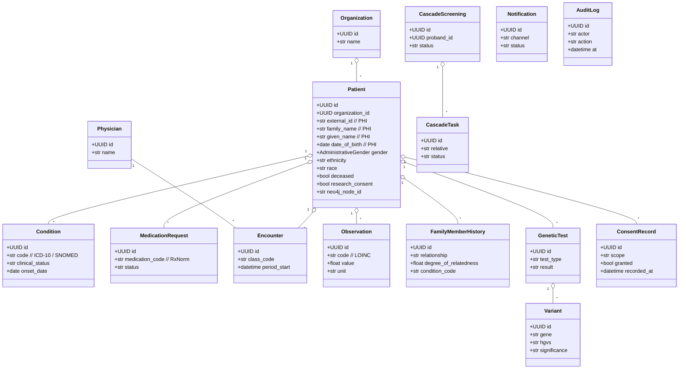

---

## 5. Database Design & Data Modeling

### 5.1 ER Diagram (PostgreSQL — Clinical Records)

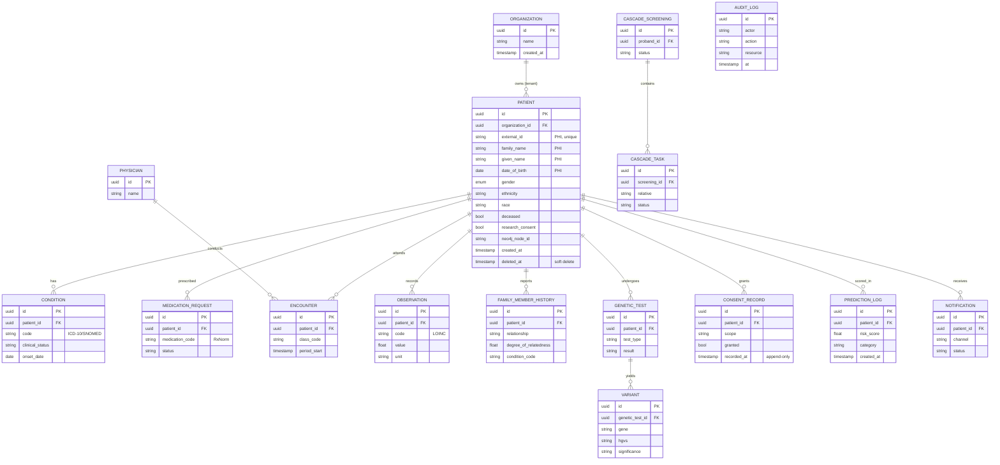

### 5.2 Graph Data Model (Neo4j — Family Graph)

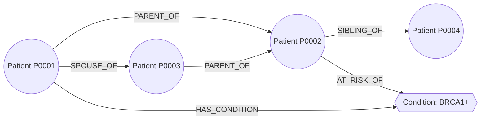

**Nodes:** `Patient`, `Condition`, `Variant`.
**Relationships:** `PARENT_OF`, `SPOUSE_OF`, `SIBLING_OF`, `HAS_CONDITION`,
`AT_RISK_OF`, each carrying a `degree_of_relatedness` where relevant (1st-degree=0.5,
2nd-degree=0.25, …). Constraints/indexes are defined in `schemas/` Cypher.

### 5.3 Logical & Physical Schema Notes

- **Keys:** UUID primary keys everywhere (`UUIDPrimaryKeyMixin`); `external_id` is a
  unique business key on `patient`.
- **Mixins:** `TimestampMixin` (created/updated), `SoftDeleteMixin` (`deleted_at` —
  supports GDPR right-to-erasure without hard delete), `ActorMixin` (who created/modified).
- **Multi-tenancy:** `organization_id` FK on `patient` (nullable for single-tenant);
  Row-Level Security policies in `schemas/postgres/versions/0010_rls_policies.py`.
- **Normalization:** 3NF for clinical entities; coded values (ICD-10/SNOMED/RxNorm/LOINC)
  stored as strings with system URIs, following FHIR.
- **Migrations:** Alembic migrations under `schemas/postgres/versions/` (initial schema →
  RLS → organization → notification → cascade → genetics → consent).
- **PHI columns:** annotated in ORM; field-level (envelope) encryption applied at rest.
- **Indexing:** indexes on `external_id`, `date_of_birth`, `gender`, `organization_id`,
  `neo4j_node_id` and FKs for join/filter performance.

---

## 6. Data Flow & System Behavior

### 6.1 Context-Level DFD (Level 0)

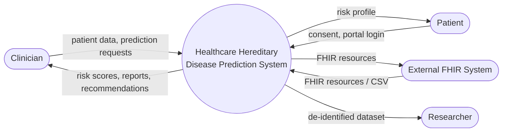

### 6.2 Detailed DFD (Level 1)

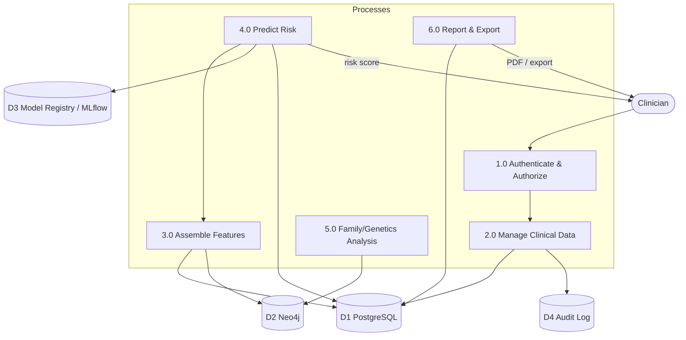

### 6.3 Sequence Diagram — Hereditary Risk Prediction

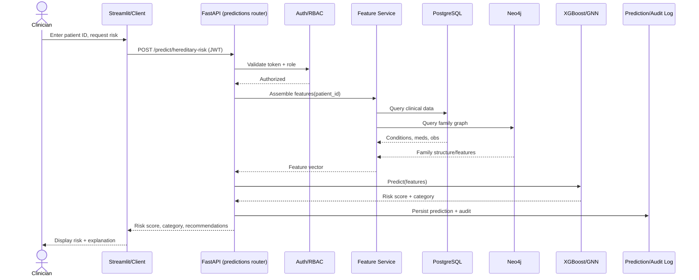

### 6.4 Sequence Diagram — Consent-Gated Research Export

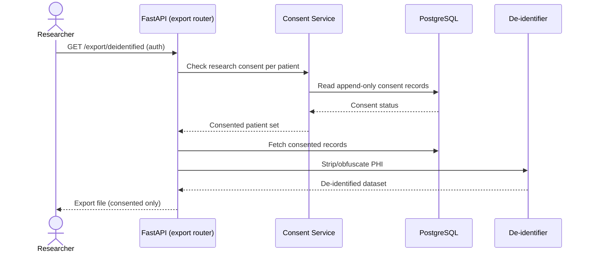

### 6.5 Activity Diagram — Prediction Workflow

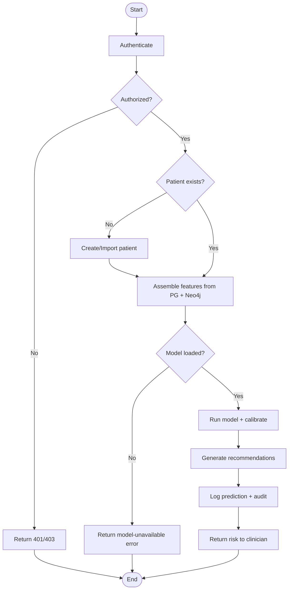

### 6.6 State Diagram — Cascade Screening Task Lifecycle

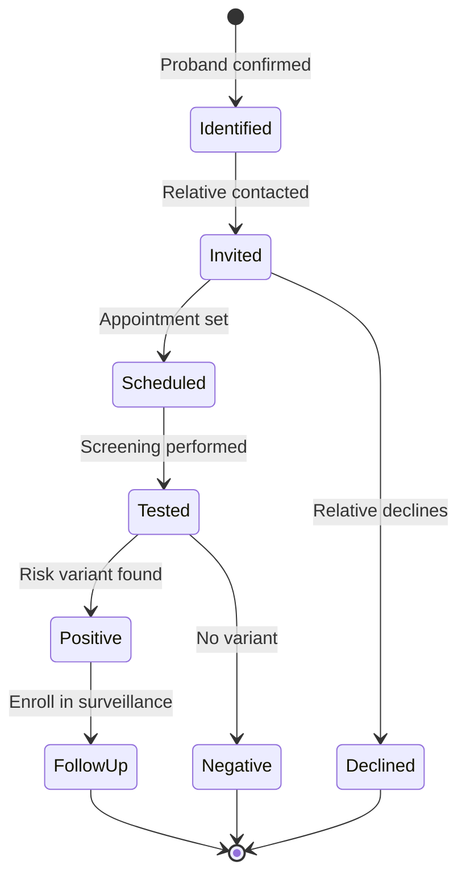

### 6.7 State Diagram — Patient Consent Record

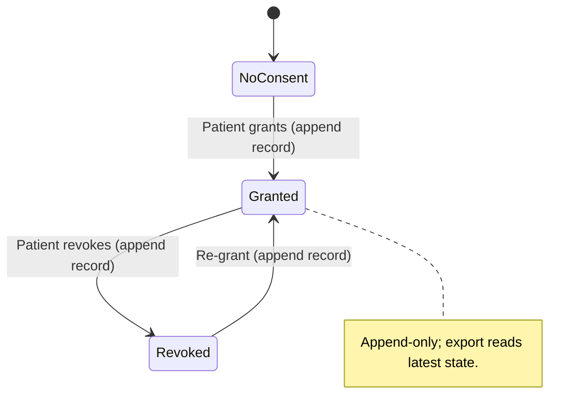

---

## 7. UI/UX Design & Prototyping

### 7.1 Wireframes & Mockups (text mockups)

> Replace with exported images/Figma links. ASCII mockups below define layout intent.

**Clinician Dashboard (Streamlit):**

```
+--------------------------------------------------------------+
|  Healthcare Hereditary Risk        [Search patient] [User ▾] |
+-------------------+------------------------------------------+
| Nav               |  Patient: Jane Doe (P0001)               |
|  • Patients       |  Age 47 · Female · Org: Metro Health     |
|  • Predictions    |------------------------------------------|
|  • Family Graph   |  Hereditary Risk:   [ 0.78 HIGH ]  ⚠     |
|  • Genetics       |  Reliability: calibrated (Brier 0.11)    |
|  • Reports        |------------------------------------------|
|  • Monitoring     |  Contributing factors:                   |
|                   |   - Family history (mother, BRCA1+)      |
|                   |   - 2 first-degree relatives affected    |
|                   |  Recommendations:                        |
|                   |   - Refer to genetic counseling          |
|                   |   - Cascade screening for siblings       |
|                   |  [ Run What-if ]  [ Generate PDF ]       |
+-------------------+------------------------------------------+
```

**Patient Portal (SMART-on-FHIR):**

```
+--------------------------------------------------+
|  My Health Portal              [Log out]         |
+--------------------------------------------------+
|  Hello, Jane                                     |
|  Your risk profile:  [ Moderate ]                |
|  Consent for research:  ( ● Granted )  [Revoke]  |
|  My records:  Conditions · Medications · Reports |
+--------------------------------------------------+
```

### 7.2 UI/UX Guidelines

| Aspect | Guideline |
|--------|-----------|
| Design system | Streamlit components + Plotly charts; consistent card layout |
| Color | Clinical, calm palette; risk uses semantic colors (green/amber/red); never rely on color alone |
| Typography | System sans-serif; ≥ 14px body; clear numeric emphasis for scores |
| Accessibility | WCAG 2.1 AA: contrast ≥ 4.5:1, keyboard nav, text labels alongside color, ARIA where applicable |
| Data safety | Never render raw PHI in shared/screenshot views beyond need; mask identifiers in exports |
| Feedback | Loading states for model calls; explicit errors when model unavailable |
| Explainability | Always show contributing factors + calibration alongside a risk score |

---

## 8. System Deployment & Integration

### 8.1 Technology Stack

| Layer | Technology |
|-------|-----------|
| Frontend | Streamlit + Plotly (dashboard), SMART-on-FHIR patient portal |
| Backend / API | FastAPI 0.110+ (Python 3.11), Pydantic v2 |
| Relational DB | PostgreSQL 15+ (SQLAlchemy ORM, Alembic migrations, RLS) |
| Graph DB | Neo4j 5.x |
| Data lake | MinIO + Delta Lake |
| Streaming / Batch | Apache Kafka (Confluent 7.6), Apache Spark 3.5 |
| Orchestration | Apache Airflow 2.9 |
| ML | XGBoost, LightGBM, PyTorch Geometric (GNN) |
| Experiment tracking | MLflow 2.x |
| Cache | Redis |
| Observability | Prometheus + Grafana; structured JSON logging |
| Containerization | Docker + Docker Compose |
| Orchestration (prod) | Kubernetes |
| IaC | Terraform 1.7+ |
| CI/CD | CI pipeline (lint, typecheck, tests, gitleaks) |

### 8.2 Deployment Diagram

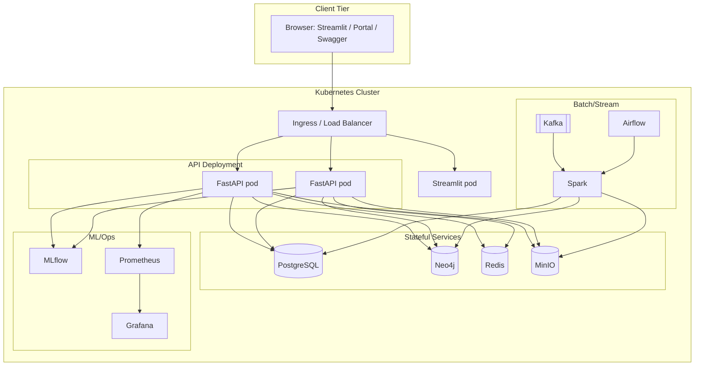

### 8.3 Component Diagram

See [§4.5 Component Diagram](#45-component-diagram). Deployment maps each component group
to containers/images built from this monorepo (`infra/docker/`), orchestrated by
Compose locally and Kubernetes in the cloud.

### 8.4 Deployment Strategy

- **Local:** `make up` → Docker Compose brings up the full stack; opt-in profiles for
  Airflow (`orchestration-up`) and Prometheus/Grafana (`observability-up`).
- **Cloud:** `terraform-init/plan/apply` provisions infra per workspace (staging/prod);
  `k8s-apply` deploys; rolling updates via `k8s-rollout`.
- **Images:** built (`make api-build`) and pushed to a registry (`make docker-push`).
- **Migrations:** `make migrate` (Alembic) + `make neo4j-schema` (Cypher constraints).
- **Config:** 12-factor env vars; secrets via `.env` locally, Vault/KMS in prod.
- **Scaling:** stateless API scales horizontally behind ingress; Redis cache; Kafka/Spark
  partition ingestion; Neo4j/Postgres run as managed/stateful sets.
- **Rollback:** versioned images + `k8s-rollout` undo; DB migrations are reversible.

---

## 9. Project Phase Status

| Phase | Description | Status |
|-------|-------------|--------|
| 1 | Foundation (monorepo, Docker Compose, CI skeleton) | ✅ Complete |
| 2 | Data Model (Postgres schema, Neo4j constraints, ORM) | ✅ Complete |
| 3 | Ingestion (Kafka, Spark, ETL loaders) | ✅ Complete |
| 4 | Feature Engineering (feature store/service) | ✅ Complete |
| 5 | ML Models (XGBoost, GNN, calibration) | ✅ Complete |
| 6 | Serving (FastAPI, Streamlit) | ✅ Complete |
| 7 | Security & Compliance (encryption, RBAC, audit, consent) | ✅ Complete |
| 8 | Observability & MLOps (Prometheus/Grafana, drift/fairness) | ✅ Complete |
| 9 | Deployment (K8s, Terraform) | ✅ Complete |

---

## 10. Additional Deliverables

### 10.1 API Documentation

The API is **self-documenting** via OpenAPI:

- **Swagger UI:** `http://localhost:8000/docs`
- **ReDoc:** `http://localhost:8000/redoc`
- **OpenAPI JSON:** `http://localhost:8000/openapi.json`
- Docs auto-disabled when `APP_ENV=production`.

**Authentication:** JWT bearer. Obtain via `POST /auth/token`, then send
`Authorization: Bearer <token>`. Machine clients may use API keys.

**Endpoint groups** (one router module per domain, see `services/api/routers/`):

| Area | Base path(s) |
|------|--------------|
| Auth | `POST /auth/token` |
| Health / metrics | `GET /health`, `GET /ready`, `GET /metrics` |
| Predictions | `POST /predict/hereditary-risk`, `/predict/disease-from-symptoms`, `/predict/disease-from-prescription` |
| Patients (CRUD) | `/patient/...`, `/patients/...` |
| Conditions / Medications | `/conditions/...`, `/medications/...` |
| Encounters / Observations | `/encounters/...`, `/observations/...` |
| Family & risk | `/family/...`, `/patient/{id}/family-risk-profile`, `/risk-history/...` |
| Batch screening | `/batch-screening/...` |
| Reports (PDF) | `/reports/...` |
| FHIR R4 | `/fhir/...` |
| Export / Import | `/export/...`, `/import/...` |
| Notifications / Orgs | `/notifications/...`, `/organizations/...` |
| Genetics | `/inheritance/...`, `/cascade/...`, `/genetics/...`, `/prs/...` |
| Decision support | `/whatif/...`, `/monitoring/...`, `/guidelines/...`, `/pedigree/...` |
| Consent / Portal | `/consent/...`, `/portal/...` |

**Example:**

```bash
# 1. Get a token
curl -X POST http://localhost:8000/auth/token \
  -H "Content-Type: application/x-www-form-urlencoded" \
  -d "username=<user>&password=<password>"

# 2. Predict
curl -X POST http://localhost:8000/predict/hereditary-risk \
  -H "Authorization: Bearer <token>" \
  -H "Content-Type: application/json" \
  -d '{ "patient_id": "P0001" }'
```

### 10.2 Testing & Validation

| Test type | Scope | Command |
|-----------|-------|---------|
| Unit | Pure functions, services, models (no external services) | `make test-unit` |
| Integration | API + DBs (services must be up) | `make test` |
| Security | PHI redaction, auth, RBAC (`tests/unit/test_security.py`) | `make test-unit` |
| Lint / Format | Ruff / Black | `make lint`, `make fmt` |
| Type check | mypy strict | `make typecheck` |

- **Coverage target:** ≥ 85% on `libs/`, `services/`, `pipelines/`, `ml/`.
- **ML validation:** calibration (Brier score + reliability diagrams); split by patient ID
  (never by row) to prevent leakage; fairness metrics across subgroups.
- **UAT plan:** clinician runs the 10 user stories in [§3.2](#32-user-stories) against a
  seeded dataset; acceptance = correct risk display, family analysis, consent enforcement,
  report generation, and audit entries for every PHI access.

**Test matrix (UAT excerpt):**

| Case | Precondition | Steps | Expected |
|------|--------------|-------|----------|
| T1 | Clinician logged in | Predict for P0001 | Risk score + category + recommendations shown; prediction logged |
| T2 | No consent | Export research dataset | P0001 excluded from export |
| T3 | Wrong role | Access admin endpoint | 403 Forbidden |
| T4 | Model not trained | Predict | Graceful "model unavailable" error |
| T5 | Bulk CSV | Import 100 patients | Validated rows inserted; invalid rows reported |

### 10.3 Deployment Strategy

See [§8.4](#84-deployment-strategy). Summary: containerized images → Compose (local) or
Terraform-provisioned Kubernetes (cloud) → migrations applied → observability enabled →
horizontal scaling of the stateless API behind ingress, with rolling deploys and reversible
migrations for rollback.

### 10.4 Security & Compliance (HIPAA/GDPR)

| Control | Implementation |
|---------|----------------|
| PHI encryption at rest | Field-level (envelope) encryption on PHI columns |
| PHI in logs | `libs/common/phi.py:redact_phi()` before any logging |
| AuthN/AuthZ | JWT auth + RBAC (`services/api/auth/`), API keys, portal auth |
| Audit | Immutable `AuditLog` on PHI access |
| Consent | Append-only `ConsentRecord`, enforced at export |
| Right to erasure | Soft delete (`SoftDeleteMixin`) |
| De-identification | Research export strips/obfuscates identifiers |
| Multi-tenant isolation | `organization_id` + Postgres RLS policies |
| Secret hygiene | 12-factor env, `.env` gitignored, gitleaks in CI, ≥ 32-char secrets |

---

## 11. Appendices

### Appendix A — References

> Add full APA/IEEE citations for all literature-review sources here.

1. HL7 FHIR R4 specification — https://hl7.org/fhir/R4/
2. _TBD_ — Family-history risk models.
3. _TBD_ — Graph Neural Networks in healthcare.
4. _TBD_ — Polygenic risk scores.
5. _TBD_ — Model calibration & fairness.

### Appendix B — Glossary

| Term | Definition |
|------|-----------|
| PHI | Protected Health Information — any data that can identify a patient |
| FHIR | HL7 Fast Healthcare Interoperability Resources (R4) |
| ICD-10 | International Classification of Diseases, 10th revision |
| SNOMED CT | Systematized Nomenclature of Medicine — Clinical Terms |
| RxNorm | Normalized names for clinical drugs |
| LOINC | Logical Observation Identifiers Names and Codes |
| Degree of relatedness | Genetic relatedness coefficient (1st=0.5, 2nd=0.25, …) |
| GNN | Graph Neural Network |
| GDS | Neo4j Graph Data Science library |
| PRS | Polygenic Risk Score |
| RLS | Row-Level Security (PostgreSQL) |
| Brier score | Calibration metric for probabilistic predictions |

### Appendix C — Repository Layout

```
services/     FastAPI API, Kafka consumers, Streamlit dashboard
pipelines/    Spark jobs (spark/) and Airflow DAGs (airflow/)
ml/           Feature definitions, training scripts, model configs, monitoring
infra/        Dockerfiles, Compose files, Kubernetes, Terraform, Grafana/Prometheus
schemas/      Neo4j Cypher constraints, Postgres Alembic migrations, Avro schemas
libs/common/  Shared library: PHI redaction, encryption, structured logging, config
tests/        unit/ integration/ fixtures/
scripts/      Dev utilities: check-env, seed, service accounts
docs/         decisions/ (ADRs), runbooks/
```

### Appendix D — Environment & Run Reference

See the [README](README.md) for full installation, configuration, and run instructions
(`make up`, `make migrate`, `make train-xgboost`, service URLs, troubleshooting).

---

*End of master documentation scaffold. Replace all `TBD`/bracketed placeholders and export
diagrams to images where a static (non-Markdown) submission format is required.*
