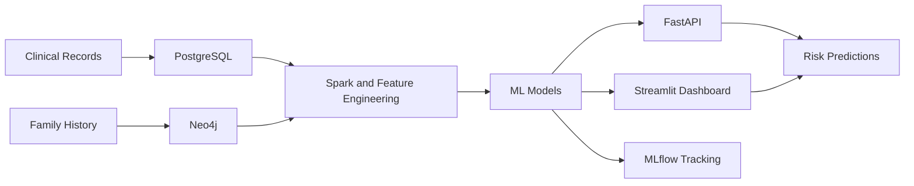

# Healthcare Hereditary Disease Prediction System

Production-oriented platform for estimating hereditary disease risk from patient records, family relationship graphs, and machine learning models.

The system is designed to help clinicians and researchers identify patients at elevated genetic risk, combine clinical and familial context in one workflow, and keep the solution aligned with healthcare data safety requirements. It is built to move cleanly from local development to containerized deployment.

## What It Does

- Combines structured clinical data with family history and relationship graphs.
- Predicts hereditary disease risk using machine learning models.
- Presents results in an interactive dashboard for review and exploration.
- Tracks experiments and model performance for reproducible iteration.
- Supports secure handling of sensitive healthcare data.

## Technology Stack

- `Neo4j` for family relationships and graph-based hereditary links.
- `PostgreSQL` for clinical records, predictions, and structured patient data.
- `Kafka` and `Spark` for ingestion and transformation workflows.
- `XGBoost` and graph-based ML modules for risk modeling.
- `MLflow` for experiment tracking and model registry support.
- `FastAPI` for application and prediction endpoints.
- `Streamlit` for the user-facing dashboard and model workflows.
- `Docker Compose` and `Terraform` for local orchestration and deployment support.

## Core Features

1. Risk prediction
   - Estimates hereditary disease risk from patient demographics, medical history, medications, and family context.
   - Produces risk scores, categories, and recommendations.

2. Family graph analysis
   - Models relatives and inheritance links in Neo4j.
   - Supports traversal-based analysis of disease patterns across families.

3. Model training and evaluation
   - Trains and evaluates predictive models with structured data pipelines.
   - Tracks metrics, calibration, and experiment history.

4. Interactive dashboard
   - Provides a visual interface for predictions, family tree views, analytics, and model training.
   - Surfaces recent predictions and operational indicators.

5. Reproducible deployment
   - Runs locally through Docker Compose.
   - Includes infrastructure code for repeatable environment setup.

## Implementation Overview

The codebase is organized as a multi-layer healthcare analytics stack:

- `schemas/` defines Neo4j constraints, PostgreSQL migrations, and Avro schemas.
- `pipelines/` contains Spark jobs and Airflow orchestration.
- `ml/` holds feature definitions, training code, model logic, calibration, and monitoring.
- `services/` contains the FastAPI backend, ingestion services, and Streamlit app.
- `infra/` includes Docker, Compose, Kubernetes, Grafana, Prometheus, and Terraform assets.
- `libs/common/` provides shared utilities for configuration, logging, de-identification, encryption, and data quality.

## Architecture Diagram



## Implementation Highlights

### Data Layer

- PostgreSQL schema for patients, diagnoses, medications, relatives, and predictions.
- Neo4j constraints and indexes for efficient family-graph traversal.

### Processing Layer

- Spark pipelines for feature engineering and ingestion.
- Shared utilities for configuration, logging, quality checks, de-identification, and encryption.

### Model Layer

- Training scripts for XGBoost and graph-based models.
- MLflow integration for experiment tracking and registry support.
- Calibration and monitoring utilities for more reliable risk scores.

### Serving Layer

- FastAPI for backend endpoints.
- Streamlit for interactive exploration, predictions, and training workflows.

### Operations Layer

- Docker-based local development environment.
- Compose files, monitoring assets, and infrastructure code for reproducible deployment.

## Getting Started

For a full local setup, see [QUICKSTART.md](QUICKSTART.md).

```bash
cp .env.example .env
make check-env
make up
make ps
```

## Project Outcome

The result is a complete end-to-end prototype that can ingest healthcare data, model hereditary risk, present predictions in an interface, and support a path toward production deployment with observability and security in mind.