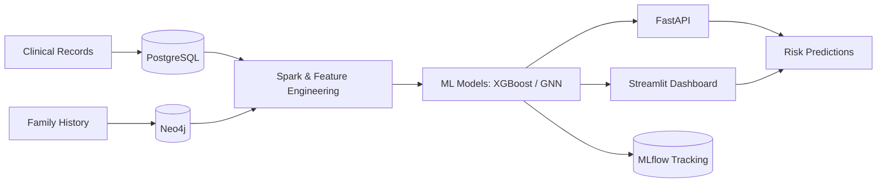

# Healthcare Hereditary Disease Prediction System

A production-grade platform for predicting **hereditary disease risk** from patient
records, family-relationship graphs, and machine-learning models. Clinical data is
stored in **PostgreSQL**, family/relationship graphs in **Neo4j**, and risk models
(**XGBoost** + GNNs) are trained and served with **MLflow** and **FastAPI**, with an
interactive **Streamlit** dashboard on top.

> ⚕️ PHI compliance (HIPAA/GDPR) is treated as non-negotiable at every layer:
> field-level encryption, audit logging, PHI redaction, and granular patient consent.

---

## Table of Contents

1. [Features](#features)
2. [Architecture](#architecture)
3. [System Requirements](#system-requirements)
4. [Installation](#installation)
5. [Configuration](#configuration)
6. [Execution Guide](#execution-guide)
7. [API Documentation](#api-documentation)
8. [Executables & Deployment](#executables--deployment)
9. [Testing & Code Quality](#testing--code-quality)
10. [Project Layout](#project-layout)
11. [Troubleshooting](#troubleshooting)
12. [License](#license)

---

## Features

- **Hereditary risk prediction** — risk score, category, and recommendations from
  demographics, comorbidities, medications, and family-graph structure.
- **Family graph analysis** — relatives and inheritance links modeled in Neo4j with
  traversal-based analysis of disease patterns.
- **Clinical data management** — CRUD for patients, conditions, medications,
  encounters, and observations/vitals.
- **Genetics & genomics** — Mendelian inheritance calculator, cascade screening,
  genetic-test ingestion, and polygenic risk score (PRS) integration.
- **ML trust & decision support** — what-if simulator, model drift/fairness
  monitoring, and guideline-based screening recommendations.
- **Interoperability & compliance** — FHIR R4 endpoints, de-identified research
  export, bulk CSV import, clinical PDF reports, and a SMART-on-FHIR patient portal.
- **MLOps** — MLflow experiment tracking & model registry, calibration and monitoring.
- **Observability** — Prometheus metrics + Grafana dashboards, structured JSON logging.

---

## Architecture



| Layer          | Technology                                        |
|----------------|---------------------------------------------------|
| Graph DB       | Neo4j 5.x                                          |
| Relational DB  | PostgreSQL 15+                                     |
| Data lake      | MinIO + Delta Lake                                |
| Streaming      | Apache Kafka (Confluent 7.6) + Spark 3.5          |
| Orchestration  | Apache Airflow 2.9                                 |
| ML             | XGBoost, LightGBM, PyTorch Geometric              |
| Tracking       | MLflow 2.x                                         |
| API            | FastAPI 0.110+ (Python 3.11)                       |
| UI             | Streamlit + Plotly                                |
| Cache          | Redis                                             |
| Infra          | Docker Compose, Kubernetes, Terraform             |

---

## System Requirements

### Software (host machine)

| Dependency        | Minimum version | Notes                                       |
|-------------------|-----------------|---------------------------------------------|
| Docker Engine     | 24.x            | With **Docker Compose v2** (`docker compose`)|
| Python            | 3.11            | For running tests / scripts outside Docker   |
| GNU Make          | 4.x             | Optional but recommended (all `make` targets)|
| Git               | 2.x             | —                                           |
| Bash              | 4+              | Used by `scripts/check-env.sh`. On Windows use Git Bash / WSL2 |

> On **Windows**, run the toolchain under **WSL2** or **Git Bash**. Docker Desktop
> must have WSL2 integration enabled.

### Hardware (local full stack)

| Resource | Minimum | Recommended |
|----------|---------|-------------|
| CPU      | 4 cores | 8+ cores    |
| RAM      | 12 GB   | 16–24 GB (full stack: Neo4j + Kafka + Spark + MinIO + MLflow) |
| Disk     | 20 GB   | 40 GB (images + volumes) |

> Running only the API + databases + Streamlit (without Kafka/Spark/Airflow) fits
> comfortably in ~8 GB RAM.

---

## Installation

### 1. Clone the repository

```bash
git clone <your-repo-url> healthcare-hereditary
cd healthcare-hereditary
```

### 2. Create your environment file

```bash
cp .env.example .env
```

Then edit `.env` and replace every `change_me_*` placeholder (see [Configuration](#configuration)).

### 3. (Optional) Install the Python package for local dev / tests

```bash
python -m venv .venv
source .venv/bin/activate          # Windows: .venv\Scripts\activate
pip install -r requirements.txt
pip install -r requirements-dev.txt   # linters, mypy, pytest
```

### 4. Validate your environment

```bash
make check-env
```

---

## Configuration

All configuration is via environment variables (12-factor). The template lives in
[`.env.example`](.env.example). Key groups:

| Group        | Variables                                                       | Purpose |
|--------------|----------------------------------------------------------------|---------|
| PostgreSQL   | `POSTGRES_HOST/PORT/DB/USER/PASSWORD`                           | Clinical records |
| Neo4j        | `NEO4J_URI`, `NEO4J_USER`, `NEO4J_PASSWORD`, `NEO4J_*_PORT`     | Family graph |
| Kafka        | `KAFKA_BOOTSTRAP_SERVERS`, `KAFKA_SCHEMA_REGISTRY_URL`          | Ingestion |
| MinIO / S3   | `MINIO_ENDPOINT`, `MINIO_ACCESS_KEY`, `MINIO_SECRET_KEY`        | Data lake |
| MLflow       | `MLFLOW_TRACKING_URI`, `MLFLOW_EXPERIMENT_NAME`                 | Model registry |
| Redis        | `REDIS_HOST/PORT/PASSWORD`                                      | Caching |
| API          | `API_PORT`, `MODEL_NAME`, `MODEL_STAGE`                         | Serving |
| Streamlit    | `STREAMLIT_PORT`                                                | Dashboard |
| Security     | `JWT_SECRET_KEY`, `ENCRYPTION_KEY`, `APP_SECRET_KEY`            | Auth & PHI encryption |
| Feature flags| `ENABLE_GNN_MODEL`, `ENABLE_SYMPTOM_MODEL`                      | Optional models |

### Generating required secrets

```bash
# Fernet key for PHI field encryption (ENCRYPTION_KEY / AIRFLOW_FERNET_KEY):
python -c "from cryptography.fernet import Fernet; print(Fernet.generate_key().decode())"

# 32+ char random secret (JWT_SECRET_KEY / APP_SECRET_KEY):
python -c "import secrets; print(secrets.token_urlsafe(48))"
```

> ⚠️ **Never commit `.env`.** It is gitignored and CI fails on secret detection.
> Secrets `< 32` chars will be rejected by the app at startup.

---

## Execution Guide

### Option A — Full stack via Docker Compose (recommended)

```bash
make up            # start Neo4j, Postgres, Kafka, Spark, MinIO, MLflow, Redis, API, Streamlit
make ps            # verify all containers are healthy
make migrate       # apply Postgres (Alembic) migrations
make neo4j-schema  # apply Neo4j constraints & indexes
```

One-shot "start everything + train a model + open the dashboard":

```bash
make run-all
```

Opt-in profiles:

```bash
make orchestration-up   # + Airflow (scheduler + webserver)
make observability-up   # + Prometheus + Grafana
```

Stop everything (volumes preserved):

```bash
make down
```

### Option B — Run individual services

```bash
# API only (plus its dependencies)
make api-up
make api-logs

# Or run the API locally against running databases:
uvicorn services.api.main:app --host 0.0.0.0 --port 8000 --reload

# Streamlit dashboard locally:
streamlit run services/streamlit/app.py --server.port 8501
```

### Service URLs

| Service        | URL                          | Credentials        |
|----------------|------------------------------|--------------------|
| Streamlit UI   | http://localhost:8501        | —                  |
| API + Swagger  | http://localhost:8000/docs   | JWT (see below)    |
| API ReDoc      | http://localhost:8000/redoc  | —                  |
| Neo4j Browser  | http://localhost:7474        | neo4j / see `.env` |
| MinIO Console  | http://localhost:9001        | see `.env`         |
| MLflow UI      | http://localhost:5000        | —                  |
| Spark UI       | http://localhost:8080        | —                  |
| Airflow        | http://localhost:8082        | see `.env` (profile `orchestration`) |
| Grafana        | http://localhost:3000        | see `.env` (profile `observability`) |
| Prometheus     | http://localhost:9090        | — (profile `observability`) |

### Training models

```bash
make train-xgboost                 # train the hereditary-risk XGBoost model
make train-gnn                     # GraphSAGE (requires ENABLE_GNN_MODEL=true)
FEATURE_DATE=2026-07-10 make train-xgboost
```

---

## API Documentation

The API is **self-documenting** — once running, interactive docs are available at:

- **Swagger UI:** http://localhost:8000/docs
- **ReDoc:** http://localhost:8000/redoc
- **OpenAPI spec:** http://localhost:8000/openapi.json

> Docs endpoints are disabled automatically when `APP_ENV=production`.

### Authentication

All clinical endpoints require a **JWT bearer token**. Obtain one, then send it as
`Authorization: Bearer <token>`.

```bash
# 1. Get a token
curl -X POST http://localhost:8000/auth/token \
  -H "Content-Type: application/x-www-form-urlencoded" \
  -d "username=<user>&password=<password>"

# 2. Call a protected endpoint
curl -X POST http://localhost:8000/predict/hereditary-risk \
  -H "Authorization: Bearer <token>" \
  -H "Content-Type: application/json" \
  -d '{ "patient_id": "P0001" }'
```

Create a service account for testing:

```bash
make service-account ARGS="create --username alice --role clinician"
```

### Endpoint groups

| Area                     | Base path(s)                                              |
|--------------------------|-----------------------------------------------------------|
| Auth                     | `POST /auth/token`                                        |
| Health / readiness       | `GET /health`, `GET /ready`, `GET /metrics`               |
| Predictions              | `POST /predict/hereditary-risk`, `.../disease-from-symptoms`, `.../disease-from-prescription` |
| Patients (CRUD)          | `/patient/...`, `/patients/...`                           |
| Conditions / Medications | `/conditions/...`, `/medications/...`                     |
| Encounters / Observations| `/encounters/...`, `/observations/...`                    |
| Family & risk history    | `/family/...`, `GET /patient/{id}/family-risk-profile`, `/risk-history/...` |
| Batch screening          | `/batch-screening/...`                                    |
| Reports (PDF)            | `/reports/...`                                            |
| FHIR R4                  | `/fhir/...`                                               |
| Export / Import          | `/export/...`, `/import/...`                              |
| Notifications / Orgs     | `/notifications/...`, `/organizations/...`                |
| Genetics                 | `/inheritance/...`, `/cascade/...`, `/genetics/...`, `/prs/...` |
| Decision support         | `/whatif/...`, `/monitoring/...`, `/guidelines/...`, `/pedigree/...` |
| Consent / Patient portal | `/consent/...`, `/portal/...`                             |

Full request/response schemas for every endpoint are in the live Swagger UI.

---

## Executables & Deployment

This platform is a set of **containerized services**, not a single compiled binary —
the "packaged application" is the set of **Docker images** built from this repo and
run via Docker Compose (local) or Kubernetes + Terraform (cloud).

### Packaged application (Docker images)

```bash
make api-build                     # build the API image
# Push to a registry (set ECR_REGISTRY / IMAGE_TAG):
make docker-push
```

### Cloud deployment (Kubernetes + Terraform)

```bash
# Provision infrastructure
make terraform-init
make terraform-plan     TF_WORKSPACE=staging
make terraform-apply    TF_WORKSPACE=staging

# Deploy to the cluster
make k8s-apply
make k8s-status
make k8s-rollout
```

### 🔗 Live deployment link

> _Add your hosted URLs here once deployed:_
>
> - **Dashboard (Streamlit):** `https://<your-deployment>/` — _TBD_
> - **API (Swagger):** `https://<your-deployment>/docs` — _TBD_

If no cloud environment is provisioned, the **local Docker Compose stack**
(`make up` → http://localhost:8501) is the runnable deliverable.

---

## Testing & Code Quality

```bash
make test-unit     # fast unit tests (no services required)
make test          # full suite (unit + integration; services must be up)
make lint          # ruff
make fmt           # black + ruff --fix
make typecheck     # mypy (strict)
```

Standards: Python 3.11+ type hints, Pydantic v2 contracts, Black + Ruff (line length
100), mypy strict, and ≥ 85% coverage on `libs/`, `services/`, `pipelines/`, `ml/`.

---

## Project Layout

```
services/     FastAPI API, Kafka consumers, Streamlit dashboard
pipelines/    Spark jobs (spark/) and Airflow DAGs (airflow/)
ml/           Feature definitions, training scripts, model configs, monitoring
infra/        Dockerfiles, Compose files, Kubernetes, Terraform, Grafana/Prometheus
schemas/      Neo4j Cypher constraints, Postgres Alembic migrations, Avro schemas
libs/common/  Shared library: PHI redaction, encryption, structured logging, config
tests/        unit/ integration/ fixtures/
scripts/      Dev utilities: check-env, seed, service accounts
docs/         decisions/ (ADRs), runbooks/
```

---

## Troubleshooting

| Symptom                                   | Fix |
|-------------------------------------------|-----|
| `make check-env` fails                    | A required var is missing/short in `.env`; regenerate secrets (≥ 32 chars). |
| API starts but "Model failed to load"     | Train a model (`make train-xgboost`) and confirm `MLFLOW_TRACKING_URI` / `MODEL_STAGE`. |
| Containers unhealthy on low-RAM machines  | Skip Kafka/Spark/Airflow; run only API + DBs + Streamlit, or raise Docker memory. |
| `docker compose` not found                | Install Docker Compose v2 (bundled with modern Docker Desktop/Engine). |
| Ports already in use                      | Change the `*_PORT` values in `.env`. |

---

## License

Released under the [MIT License](LICENSE) — free to use, modify, and distribute.
This project handles simulated/synthetic healthcare data for development; do not
load real PHI without completing the security controls in the compliance phase.
```

