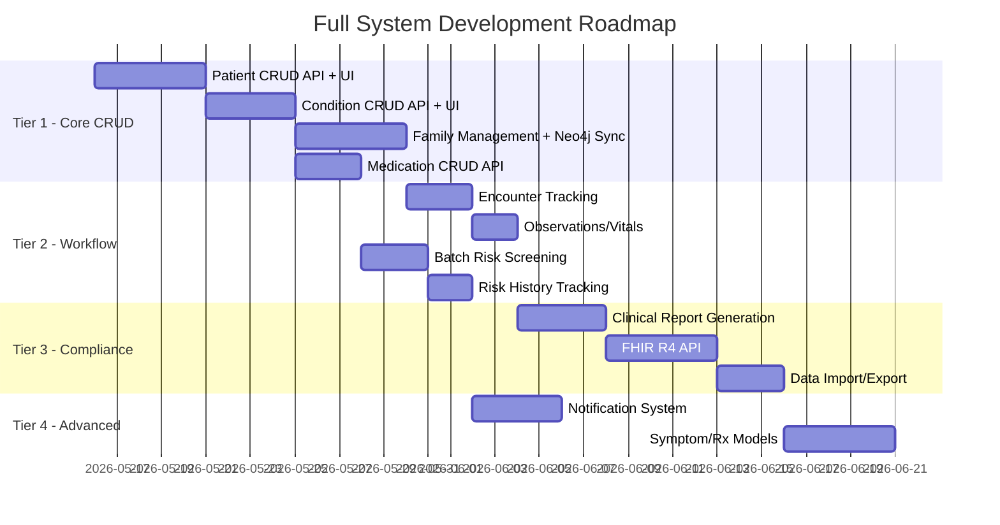

# Feature Recommendations — Full System Roadmap

## Current System Gap Analysis

Your codebase has excellent **infrastructure** (9 ORM models, 3 service layers, auth/RBAC, encryption, PHI redaction) but the API only exposes **read-only prediction endpoints**. There are no CRUD operations for any entity — you can't add a patient, record a diagnosis, or link family members through the app.

### What Exists Today

| Layer | What's Built | What's Missing |
|---|---|---|
| **DB Models** | Patient, Condition, Encounter, Observation, MedicationRequest, FamilyMemberHistory, Physician, AuditLog | No CRUD service layer connecting them to API |
| **API Routes** | `/predict/*` (3 endpoints), `/patient/{id}/family-risk-profile`, `/auth/token`, `/health`, `/metrics` | No POST/PUT/DELETE for any entity |
| **Streamlit UI** | Dashboard, Risk Prediction, Family Tree, Model Training, Analytics | All data is hardcoded mock — no forms to create/edit |
| **Auth** | JWT tokens, RBAC middleware, service accounts | No user registration, no patient-facing auth |

---

## Recommended Features (Priority Order)

### 🔴 Tier 1 — Core CRUD (Make It a Real System)

These are **essential** to make the system functional. Without them, it's a demo.

---

#### 1. Patient Management API + UI

**API Endpoints** (new router: `services/api/routers/patient_crud.py`):

| Method | Endpoint | Description |
|---|---|---|
| `POST` | `/patients` | Register a new patient |
| `GET` | `/patients` | List patients (paginated, searchable) |
| `GET` | `/patients/{id}` | Get patient details |
| `PUT` | `/patients/{id}` | Update patient info |
| `DELETE` | `/patients/{id}` | Soft-delete (sets `deleted_at`) |
| `GET` | `/patients/{id}/summary` | Full clinical summary (conditions + meds + family) |

**Streamlit UI** — New "👤 Patient Management" page:
- Patient registration form with FHIR-compliant fields
- Searchable patient table with filters (gender, age range, risk tier)
- Patient detail view with tabs: Demographics, Conditions, Medications, Family, Risk History

> [!IMPORTANT]
> All PHI fields (name, DOB, phone, email, address) must be encrypted via `EncryptionService` before writing to PostgreSQL. The existing [encryption.py](file:///d:/Healthcare%20-%20Depi/libs/common/encryption.py) already supports this.

---

#### 2. Disease/Condition Management API + UI

**API Endpoints** (new router: `services/api/routers/conditions.py`):

| Method | Endpoint | Description |
|---|---|---|
| `POST` | `/patients/{id}/conditions` | Record a new diagnosis |
| `GET` | `/patients/{id}/conditions` | List patient's conditions |
| `PUT` | `/conditions/{id}` | Update condition (status, severity) |
| `DELETE` | `/conditions/{id}` | Soft-delete a condition |
| `GET` | `/conditions/search` | Search by ICD-10 code or display name |

**Key Fields** (already defined in [condition.py](file:///d:/Healthcare%20-%20Depi/libs/common/models/condition.py)):
- ICD-10/SNOMED code + display text
- Clinical status (active/remission/resolved)
- Severity (mild/moderate/severe)
- `is_hereditary` flag — critical for the ML pipeline
- Onset date/age

**Streamlit UI** — Condition entry form with:
- ICD-10 code autocomplete/search
- Auto-detection of hereditary conditions (lookup against OMIM/ClinVar)
- Timeline visualization of condition history

---

#### 3. Family Relationship Management API + UI

**API Endpoints** (new router: `services/api/routers/family.py`):

| Method | Endpoint | Description |
|---|---|---|
| `POST` | `/patients/{id}/family` | Add a family member relationship |
| `GET` | `/patients/{id}/family` | List family members |
| `PUT` | `/family/{id}` | Update relationship details |
| `DELETE` | `/family/{id}` | Remove a family link |
| `POST` | `/patients/{id}/family/link` | Link to existing patient in system |

**Auto-sync to Neo4j**: When a `FamilyMemberHistory` record is created, the API should:
1. Write to PostgreSQL (source of truth)
2. Trigger a Neo4j edge creation (bidirectional)
3. Set `neo4j_synced = True`

**Streamlit UI** — Interactive family tree builder:
- Visual pedigree editor (drag-and-drop nodes)
- Auto-compute `degree_of_relatedness` from relationship type
- Highlight affected relatives with color-coded disease markers

---

#### 4. Medication Management API

**API Endpoints** (new router: `services/api/routers/medications.py`):

| Method | Endpoint | Description |
|---|---|---|
| `POST` | `/patients/{id}/medications` | Prescribe/record a medication |
| `GET` | `/patients/{id}/medications` | List medications (active, completed, stopped) |
| `PUT` | `/medications/{id}` | Update status/dosage |
| `PUT` | `/medications/{id}/status` | Quick status change (active→completed) |

---

### 🟡 Tier 2 — Clinical Workflow Features

Once CRUD exists, these make the system **useful in practice**.

---

#### 5. Encounter/Visit Tracking

| Method | Endpoint | Description |
|---|---|---|
| `POST` | `/patients/{id}/encounters` | Start a new clinical encounter |
| `PUT` | `/encounters/{id}/close` | Close encounter with outcome |
| `GET` | `/encounters/{id}` | Encounter details with linked conditions/observations |

The [Encounter model](file:///d:/Healthcare%20-%20Depi/libs/common/models/encounter.py) already exists — it links conditions, observations, and medication requests to specific visits.

---

#### 6. Clinical Observations/Vitals

| Method | Endpoint | Description |
|---|---|---|
| `POST` | `/patients/{id}/observations` | Record a lab result or vital sign |
| `GET` | `/patients/{id}/observations` | List observations with LOINC code filtering |

Uses the existing [Observation model](file:///d:/Healthcare%20-%20Depi/libs/common/models/observation.py). Supports LOINC-coded labs and vitals.

---

#### 7. Batch Risk Screening

| Method | Endpoint | Description |
|---|---|---|
| `POST` | `/predict/batch-screen` | Run hereditary risk prediction on multiple patients |
| `GET` | `/predict/batch-screen/{job_id}` | Poll batch job status |

**Why**: Clinics need to screen entire patient panels, not one patient at a time. Use Celery/Redis for async processing.

---

#### 8. Risk History & Trend Tracking

| Method | Endpoint | Description |
|---|---|---|
| `GET` | `/patients/{id}/risk-history` | Risk score over time |

Every prediction already gets cached — persist these to a `prediction_log` PostgreSQL table so clinicians can track how risk evolves as new conditions/family data are added.

---

### 🟠 Tier 3 — Reporting & Compliance

---

#### 9. Clinical Report Generation

- **Patient Summary PDF** — One-page clinical summary with risk score, family tree, SHAP explanation
- **Population Health Dashboard** — Aggregate risk distribution, demographic breakdowns, screening rates
- **Audit Report** — All access to PHI logged via the existing [AuditLog model](file:///d:/Healthcare%20-%20Depi/libs/common/models/audit_log.py)

---

#### 10. FHIR R4 Interoperability API

Your models already follow FHIR R4 naming. Add proper FHIR endpoints:

| Endpoint | Description |
|---|---|
| `GET /fhir/Patient/{id}` | Return FHIR R4 Patient JSON |
| `GET /fhir/Condition?patient={id}` | FHIR Bundle of conditions |
| `POST /fhir/Bundle` | FHIR transaction bundle import |

This enables integration with Epic, Cerner, and other EHR systems.

---

#### 11. Data Import/Export

| Feature | Description |
|---|---|
| CSV Import | Bulk patient upload with validation (Great Expectations) |
| HL7 FHIR Import | Accept FHIR Bundles from external systems |
| De-identified Export | Research data export using existing [deidentification.py](file:///d:/Healthcare%20-%20Depi/libs/common/deidentification.py) |

---

### 🔵 Tier 4 — Advanced / Nice-to-Have

---

#### 12. Notification System

- Alert when a patient's risk score crosses a threshold
- Notify when new family member data changes risk profile
- Weekly screening reminder digest for high-risk patients

---

#### 13. Multi-Tenant Support

- Separate patient data by healthcare organization
- Organization-scoped API keys
- Cross-org anonymized research data sharing

---

#### 14. Symptom & Prescription Models (Complete Stubs)

The two stub endpoints in [predictions.py](file:///d:/Healthcare%20-%20Depi/services/api/routers/predictions.py) (`/predict/disease-from-symptoms`, `/predict/disease-from-prescription`) currently return `503`. Implement:
- Multi-label symptom classifier (ICD-10 symptom codes → differential diagnosis)
- Medication-to-condition reverse inference model

---

## Suggested Implementation Order



---

## Architecture for New Features

All new CRUD features should follow this pattern (already established in the codebase):

```
services/api/routers/patient_crud.py    ← FastAPI endpoints
services/api/schemas/patient_schemas.py ← Pydantic request/response models
services/api/services/patient_service.py ← Business logic + DB operations
libs/common/models/patient.py           ← SQLAlchemy ORM (already exists)
services/streamlit/pages/patients.py    ← Streamlit UI page
```

> [!TIP]
> Your existing `libs/common/encryption.py` and `libs/common/phi.py` should wrap all PHI writes automatically. Add a `@encrypt_phi_fields` decorator to the service layer.

> [!WARNING]
> Every new endpoint that accepts or returns PHI **must** be wrapped with the RBAC middleware from [rbac.py](file:///d:/Healthcare%20-%20Depi/services/api/auth/rbac.py) and logged via [audit_log.py](file:///d:/Healthcare%20-%20Depi/libs/common/models/audit_log.py).

---

# Beyond the Roadmap — Net-New Features

> Tiers 1–4 above are largely built. The features below go beyond that roadmap and
> target the one thing that makes this a *hereditary disease* platform: the genetics
> engine, which is currently the thinnest part of the system. "Hereditary risk" is
> today inferred only from family history + ML — there is no actual genetics layer.

---

### 🧬 Tier 5 — Genetics & Genomics (highest domain value)

---

#### 15. Mendelian Inheritance Calculator

Given a pedigree and an affected proband, compute carrier/affected probabilities for
each relative using inheritance mode (autosomal dominant/recessive, X-linked) plus
penetrance. Deterministic and fully explainable — complements the ML model rather
than competing with it.

| Method | Endpoint | Description |
|---|---|---|
| `POST` | `/patients/{id}/inheritance-risk` | Compute Mendelian carrier/affected probabilities across the pedigree |
| `GET` | `/inheritance/models` | List supported inheritance modes + penetrance defaults |

- Reuses the `degree_of_relatedness` already stored on `FamilyMemberHistory`.
- Bayesian carrier-risk propagation across the Neo4j family graph.
- Output feeds the "what-if" simulator (#19) and the clinical report (#9).

---

#### 16. Cascade Screening Workflow ⭐ (highest clinical impact)

When a patient is diagnosed with a hereditary condition, auto-generate a **ranked
list of at-risk relatives** and produce outreach/screening tasks. This is *the*
core clinical-genetics workflow and exercises infrastructure you already have.

| Method | Endpoint | Description |
|---|---|---|
| `POST` | `/patients/{id}/cascade-screen` | Identify at-risk relatives for a proband's hereditary condition |
| `GET` | `/patients/{id}/cascade-screen` | List generated screening tasks + outreach status |
| `PUT` | `/cascade-tasks/{id}` | Update task status (contacted / screened / declined) |

- Ranks relatives by `degree_of_relatedness` × condition penetrance.
- Emits notifications via the existing notification service.
- Every access logged through `AuditLog` (relatives are PHI).

---

#### 17. Genetic Test Result Ingestion

Accept VCF files or lab reports, annotate variants against ClinVar/OMIM, and store
pathogenicity classifications on the patient. Feeds both the ML pipeline
(`is_hereditary`) and the Mendelian calculator (#15).

| Method | Endpoint | Description |
|---|---|---|
| `POST` | `/patients/{id}/genetic-tests` | Upload VCF / structured variant report |
| `GET` | `/patients/{id}/genetic-tests` | List annotated variants + pathogenicity |

- New ORM model: `GeneticTest` / `Variant`.
- Variant annotation service (ClinVar/OMIM lookup) under `services/api/services/`.

---

#### 18. Polygenic Risk Score (PRS) Integration

Combine the XGBoost/GNN output with published PRS for common diseases to produce a
blended risk estimate. Track PRS panels in MLflow alongside existing models.

---

### 🤖 Tier 6 — ML Trust & Decision Support

---

#### 19. "What-If" Risk Simulator

Let a clinician toggle a relative's disease status or add a condition and see risk
recompute live. Pairs directly with the existing SHAP explanations.

- Streamlit UI: interactive controls on the risk page that call `/predict/*` with
  a modified in-memory patient graph (no writes to the DB).

---

#### 20. Model Monitoring & Fairness Dashboard

Drift detection + risk-score parity across demographic groups (age / sex / ethnicity).
Important for a regulated PHI system; complements the MLflow setup.

- Reuses monitoring utilities under `ml/`.
- Surfaces reliability diagrams + Brier score already required before model release.

---

#### 21. Guideline-Based Screening Recommendations

Map predicted risk to established clinical criteria (NCCN BRCA/Lynch, colonoscopy
age thresholds, etc.) and surface **actionable next steps** instead of a bare score.

---

#### 22. GNN Link Prediction for Pedigree Completion

Use the graph model to suggest likely-missing family edges in Neo4j, helping
clinicians complete incomplete pedigrees.

---

### 🔐 Tier 7 — Patient-Facing & Consent

---

#### 23. Consent Management

Granular patient consent for research use / data sharing, **enforced at the export
and de-identification layers** already in place.

| Method | Endpoint | Description |
|---|---|---|
| `POST` | `/patients/{id}/consent` | Record/update consent scope |
| `GET` | `/patients/{id}/consent` | Current consent state (checked before export) |

---

#### 24. Patient Portal (SMART on FHIR)

Read-only patient view of their own risk profile and family tree, launched via
SMART on FHIR so it plugs into Epic/Cerner. Builds on the FHIR R4 API (#10).

---

#### 25. Real-Time Streaming Risk Recomputation

Wire a Kafka consumer so that a new condition or family edge triggers automatic risk
recalculation + a notification. Uses the existing Kafka/Spark infrastructure and the
notification service.

---

## Recommended Priority

Start with **#16 (Cascade Screening)** and **#15 (Mendelian Calculator)** — highest
clinical value, they reuse infrastructure you already have (family graph, relatedness,
audit log, notifications), and they are what distinguish this from a generic EHR.
